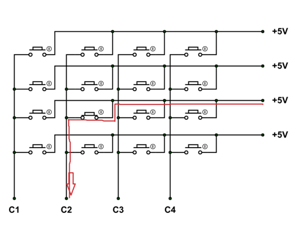
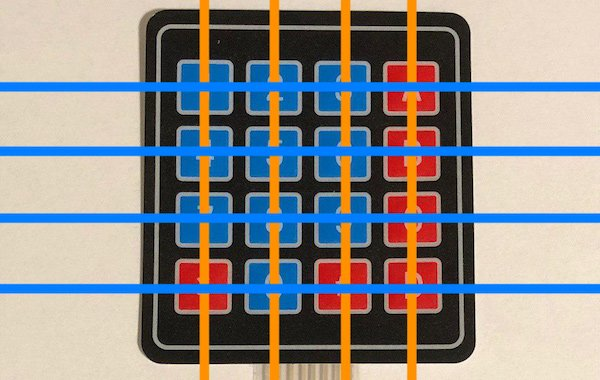
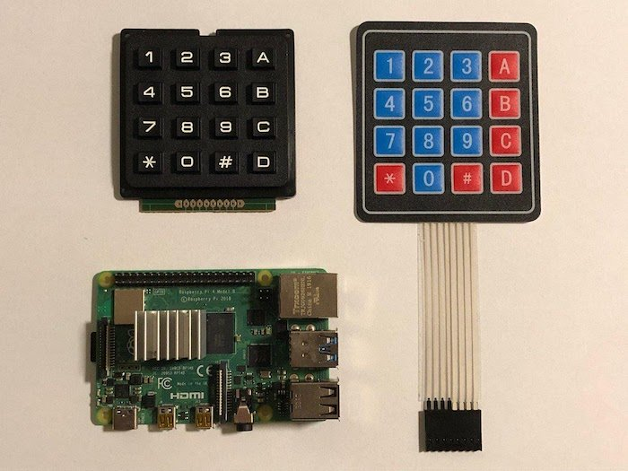

Project: Python + Electronics + Raspberry Pi
========================
### Goal
There must be a input NFC scanner & Keypad, that allows users to scan there card and type in their pin, and then a pixel output-er to show the user whether It was successful or not. I will use the JSON python library to add NFC card to the scannable NFC cards
### Hardware:
- Raspberry Pi
- LCD Display
- NFC Reader
- Keypad
### Software
- Python
- NFC Reader module
- Keypad module
- LCD display module
- JSON module
## Research Into Components
### Possible?
All of the components are compatible with the raspberry pi and python.
### Links to the tutorials
- [Using the keypad](https://maker.pro/raspberry-pi/tutorial/how-to-use-a-keypad-with-a-raspberry-pi-4)
- [Using the LCD](https://pimylifeup.com/raspberry-pi-lcd-16x2/)
- [Using the NFC reader](https://www.youtube.com/watch?v=8_tLz9PI_qA) or [on pi my life up](https://pimylifeup.com/raspberry-pi-rfid-rc522/)
## Planning out the circuit
### Are there enough GPIO pins?
Yes - There are 26 GPIO pins, however we use up 18 with this project (5 for the LCD, 8 for the keypad and 5 for the NFC, with 8 pins to spare).
### Can all of the components be controlled with python?
Yes - each of them has libraries in python, so that each of them.
### The actual plan
 
### What does each pin mean on the RFID NFC Reader
- GND = Ground Voltage
- 3.3V = Positive voltage for the reader
- MOSI = Master Out Slave In = Whether the pi (Master) is sending data to the NFC reader (Slave) along this channel
- MOSI = Master Out Slave In = Whether the pi (Master) is receiving data from the NFC reader (Slave).
- SCK = The Serial ClocK = The pulse/rate at which the data in moved around by the master
- SDA = Serial DAta = The actual data communication
- RST = Reset
- IR = Interrupt Request = Asking to stop the transmission of Data
## Writing the test code
First, we must test each of the components, and to do that we must write some python code.
### LCD Display
First, we must install the correct LCD module
```
pip install RPLCD
```
Then, we must create a file (`nano main.py`) and enter this code into it:
```
from RPLCD import CharLCD
from time import sleep
import RPi.GPIO as GPIO
GPIO.setwarnings(False)
lcd = CharLCD(numbering_mode=GPIO.BCM, cols=16, rows=2, pin_rs=4, pin_e=17, pins_data=[27, 18, 23, 26])
try:
    while True:
        lcd.write_string("Hello people!")
        sleep(1)
        lcd.clear()
except KeyboardInterrupt:
    GPIO.cleanup()
```
Then, run that python script and it should do as stated in the file.

### NFC Reader

- Let’s begin by first opening the raspi-config tool, and we can do this by opening the terminal and running the following command.

```
sudo raspi-config
```

- This tool will load up a screen showing a variety of different options. If you want a more in-depth look into these options, you can check out our raspi-config guide.

On here use the arrow keys to select “5 Interfacing Options“. Once you have this option selected, press Enter.

- Now on this next screen, you want to use your arrow keys to select “P4 SPI“, again press Enter to select the option once it is highlighted.

- You will now be asked if you want to enable the SPI Interface, select Yes with your arrow keys and press Enter to proceed. You will need to wait a little bit while the raspi-config tool does its thing in enabling SPI.

- Once the SPI interface has been successfully enabled by the raspi-config tool you should see the following text appear on the screen, “The SPI interface is enabled“.

Before the SPI Interface is fully enabled we will first have to restart the Raspberry Pi. To do this first get back to the terminal by pressing Enter and then ESC.

Finally, reboot:  
```
sudo reboot now
```

-  Once your Raspberry Pi has finished rebooting, we can now check to make sure that it has in fact been enabled. The easiest way to do this is to run the following command to see if spi_bcm2835 is listed.

```
lsmod | grep spi
```

If you see spi_bcm2835, then you can proceed on with this tutorial and skip on to the next section. If for some reason it had not appeared when you entered the previous command, try following the next three steps.

- If for some reason the SPI module has not activated, we can edit the boot configuration file manually by running the following command on our Raspberry Pi.nfc 

```
sudo nano /boot/config.txt
```

- Within the configuration file, use Ctrl + W to find “dtparam=spi=on“.

If you have found it, check to see if there is a # in front of it. If there is, remove it as this is commenting out the activation line. If you can’t find the line at all, add “dtparam=spi=on” to the bottom of the file.

Once you have made the changes, you can press Ctrl + X then pressing Y and then Enter to save the changes.

You can now proceed from Step 5 again, rebooting your Raspberry Pi then checking to see if the module has been enabled.

*The above was taken from the pi my life up article*

Now we must get python ready for our NFC reader.

Lets install the needed python libraries 
```
sudo pip3 install spidev
sudo pip3 install spidev
```

Then, add this python code to a `writer.py`:
```
# Import the library
import RPi.GPIO as GPIO
from mfrc522 import SimpleMFRC522

# Get the reader
reader = SimpleMFRC522()

Add the cards, and then exit properly
try:
        text = input('New data:')
        print("Now place your tag to write")
        reader.write(text)
        print("Written")
finally:
        GPIO.cleanup()
```
Run this, and add a couple of cards/fobs to your devices.
Do the same with this in a `reader.py`:
```
#!/usr/bin/env python

# Import the library
import RPi.GPIO as GPIO
from mfrc522 import SimpleMFRC522

# Get the reader
reader = SimpleMFRC522()

# Read in the cards, and then exit properly
try:
        id, text = reader.read()
        print(id)
        print(text)
finally:
        GPIO.cleanup()
```
Run this, and it should see your cards/fobs.
### The keypad
The code for the keypad is very simple, here it is.
```
import RPi.GPIO as GPIO
# from EmulatorGUI import GPIO
import time

L1 = 5
L2 = 6
L3 = 13
L4 = 19

C1 = 12
C2 = 16
C3 = 20
C4 = 21

GPIO.setwarnings(False)
GPIO.setmode(GPIO.BCM)

GPIO.setup(L1, GPIO.OUT)
GPIO.setup(L2, GPIO.OUT)
GPIO.setup(L3, GPIO.OUT)
GPIO.setup(L4, GPIO.OUT)

GPIO.setup(C1, GPIO.IN, pull_up_down=GPIO.PUD_DOWN)
GPIO.setup(C2, GPIO.IN, pull_up_down=GPIO.PUD_DOWN)
GPIO.setup(C3, GPIO.IN, pull_up_down=GPIO.PUD_DOWN)
GPIO.setup(C4, GPIO.IN, pull_up_down=GPIO.PUD_DOWN)

def readLine(lineNumber, line, characters):
    GPIO.output(line, GPIO.HIGH)
    if (GPIO.input(C1) == GPIO.HIGH):
        print(characters[0])
    if (GPIO.input(C2) == GPIO.HIGH):
        print(characters[1])
    if (GPIO.input(C3) == GPIO.HIGH):
        print(characters[2])
    if (GPIO.input(C4) == GPIO.HIGH):
        print(characters[3])
    GPIO.output(line, GPIO.LOW)

try:
    while True:
        readLine(1, L1, ["1","4","7","*"])
        readLine(2, L2, ["2","5","8","0"])
        readLine(3, L3, ["3","6","9","#"])
        readLine(4, L4, ["A","B","C","D"])
        time.sleep(0.1)
except KeyboardInterrupt:
    print("\nApplication stopped!")
```
Then, run the script above to test it is working.
### Notes
All above code has been taken from the tutorials mentioned earlier on. If there is an error, or it doesn't work, make sure that you have setup the GPIO pins correctly, and that you have installed the correct modules 

**With the testing module**

Using the grid from the picture below, you should be able to work out whether it is working or not, based on the output of the python program. 





 